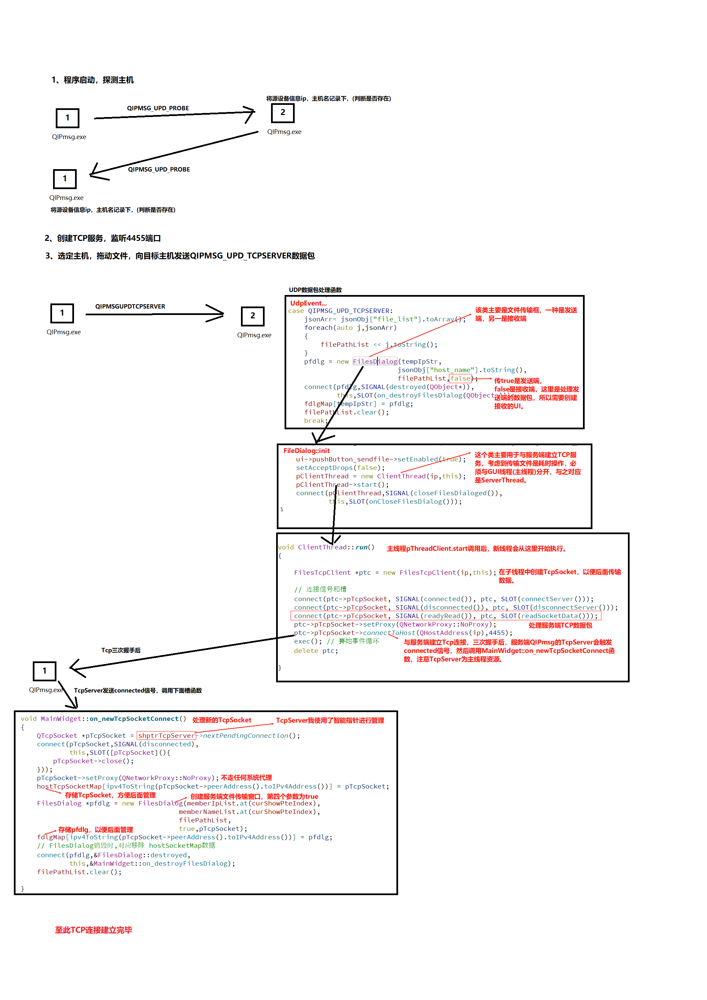

# **QIPmsg**
&ensp;&ensp;本程序基于**QT5**实现，支持**局域网下主机探测**、**即时消息**(udp实现)、<br>
**一对一发送文件**(速率上线取决于当前局域网设备，tcp实现)、<br>
**多对一发送文件**（多线程+tcp实现）
1. [使用注意事项](#使用注意事项)
2. [效果展示](#效果展示)
3. [部分实现过程](#部分实现过程)
4. [更新日志](#更新日志)
5. **最后有什么问题评论区讨论(不要吝啬你们的stars哦^v^)**

## **使用注意事项**
1. 选中目标主机，在文本框键内容，最后Enter
(Shift+Enter换行)<br>即可发送消息。

2. 选中主机，拖动文件到主程序即可弹出文件发送框，<br>
文件发送框支持拖动文件增加列表，双击列表框某一项即可删除，<br>
点击发送，等待对方确认即可。

3. 注意设置防火墙允许本程序在专有网络(私有)下进行通信，<br>
可以手动设置防火墙入站规则。

## **效果展示** 
[见CSDN](https://blog.csdn.net/qq_66590039/article/details/143415422?fromshare=blogdetail&sharetype=blogdetail&sharerId=143415422&sharerefer=PC&sharesource=qq_66590039&sharefrom=from_link)

## **部分实现过程** 


## **更新日志** 
```
#define QIPMSG_VERSION              "0.1.4"
/*
 * 增加程序英文翻译(匹配当前系统显示语言环境)
 * */

//#define QIPMSG_VERSION              "0.1.3"
/*
 * 1、修复ui组件忽大忽小问题
 *
 * 2、解决了win7x32下 主动退出文件接受界面时，
 * 程序崩溃问题。
   FilesDialog::closeEvent
    ...
    if(pClientThread&&pClientThread->isRunning()){
        pClientThread->quit();
        pClientThread->wait(); // 新增
        pClientThread->deleteLater();
        pClientThread = nullptr;
    }
    ...
 * */

//#define QIPMSG_VERSION              "0.1.2"
/*
 * 解决了一些ui中textedit忽大忽小问题
 *
 * */

//#define QIPMSG_VERSION              "0.1.1"
/*
 * 修复(TLS) 多对一同时发送文件时 线程资源竞争问题，
 * FilesTcpClient::readSocketData 使用了静态局部变量，
 * 导致多个线程对同一个变量操作，触发线程安全问题
void FilesTcpClient::readSocketData()
        ...
        static QFile *pFile;
        static qint64 bytesToWriten=0;
        static qint64 fileSize = 0;
        switch (jsonObj["type"].toInt())
 */

```


